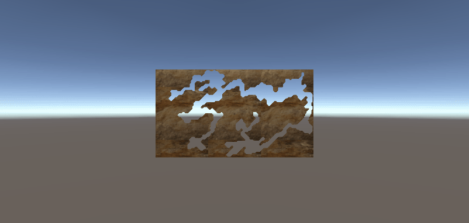

# [Unity](https://unity.com/) Prototype procedural cave generation.

## Project Description:
Generate a cave procedurally.
See [course](https://www.youtube.com/channel/UCmtyQOKKmrMVaKuRXz02jbQ) and [reference code](https://github.com/SebLague/Procedural-Cave-Generation).

## Screenshots

